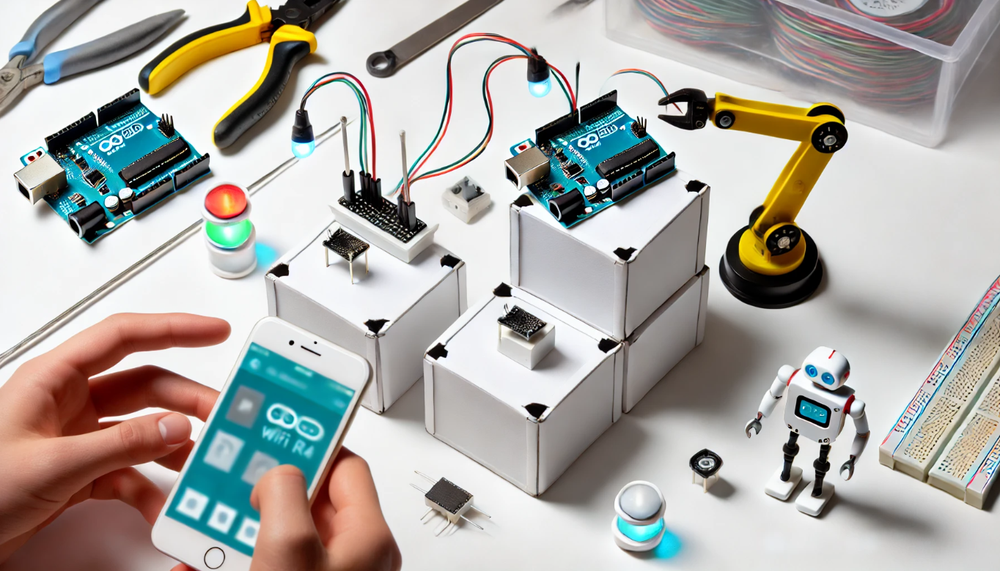

# DEISI18 - IoT_Lab2.0-CGI-Industria
- **Autor :**  Samir Natvarlal & Ricardo Borges

## **Descrição**
  Este projeto explora a aplicação da Internet of Things (IoT) na indústria, visa solucionar os desafios de comunicação entre máquinas próximas fisicamente, mas distantes tecnologicamente no modelo M2M (Machine-to-Machine). O objetivo é conseguir superar a falta de interação entre essas máquinas, proporcionando uma integração eficiente para otimizar processos industriais. Adicionalmente, neste trabalho não apenas realça a aplicabilidade, mas também aborda os desafios associados aos conceitos de IoT na indústria. Propõe uma visão integrada para a gestão e otimização operacional das linhas de produção, incluindo máquinas, atuadores e sensores, consolidando informações de forma abrangente, com inclusão de uma Base de Dados e com uma simples integração de modelos preditivos.




## Tabela de Conteúdos
- [Instalação](#instalação)
- [Configuração](#configuração)
- [Repositórios Git](#repositórios)
- [Vídeo de demonstração](#videodedemonstracao)
- [Testes](#testes)
- [Contacto](#contacto)


## Instalação
- **Back-end**
  - Arduino IDE : https://www.arduino.cc/en/software (Versão 2.3.2)
  - Broker MQTT : https://mosquitto.org/ (Mosquitto)
  - FireBase : (Uso online)

- **Front-end**
  - Android Studio : https://developer.android.com/studio?hl=pt-br (para a Aplicação Móvel)
  - Flutter SDK : https://docs.flutter.dev/release/archive (Versão 3.19.2/3.19.5)
  - Dart SDK : https://dart.dev/get-dart (Versão 3.3.0)

- **Extra**
  - GitHub : https://desktop.github.com/download/
  - MQTT : https://mqtt-explorer.com/ (Para visualizar informações da comunicação entre Front-End e Back-End)


## **Configuração**
### => Arduino IDE

1. Instalar o Arduino IDE.
2. Abrir o Arduino IDE.
3. Instalar as Library s
4. Instalar Board : Arduino UNO R4 WIFI
5. Usa seguintes linhas de código para configurar rede WI-FI e o broker MQTT .

   ```cpp
    // Configurações de WiFiº
     const char* ssid = " "; // Substitua pelo SSID da sua rede WiFi
     const char* password = " "; // Substitua pela senha da sua rede WiFi

    // Configurações do Broker MQTT
     const char* mqtt_server = " "; // Substitua pelo IP do seu broker M
7. Bibliotecas usadas

   ```cpp
    #include <WiFiS3.h>
    #include <PubSubClient.h>

### => Android Studio  

1.  Para configuração do Android studio é seguido o seguinte tutorial : https://www.youtube.com/watch?v=suHkmP0oChk .
2.  Tirando a parte do codigo, a configuração do MQTT, sempre para fazer a ligação com o MQTT, os passos são: (situado na página 'Controlar')
    - 1. Subscribe
      2. Escollha do Modo
      3. Disconneted (para terminar a ligação).
  
4.  Depois foi criado um "new Repository" no Git e foi feito um :
     ```cpp
       git clone https://github.com/DEISI-ULHT-TFC-2023-24/TFC-DEISI14-IoT_Lab2.0-CGI-Industria.git

 NOta: modo programador, sdk flutter selecionada , sdk dart selecionada, emulador (telemóvel) instalada e criada. 


## **Repositórios Git**
### Front-end (App)
- https://github.com/SamirNatvarlal/TFC_IoT_Lab2.0-CGI-Industria.git

### Back-end (Arduino e Base de Dados)
- https://github.com/SamirNatvarlal/SamirNatvarlal-a22207165-RicardoBorges-a2203987-TFC_DEISI14-IoT_Lab2.0-CGI-Industria-ArduinoPart.git
- https://github.com/SamirNatvarlal/tfc_inf_MySQL.git

## **Vídeo de demonstração**
- Link do trabalho atual: Por Fazer!!
- Link do trabalho anterior: https://youtu.be/d4dT4sH1530

## **Testes**
- Para uso teste da aplicação as credênciais são
    - User: admin
    - Pass: 12345
 
